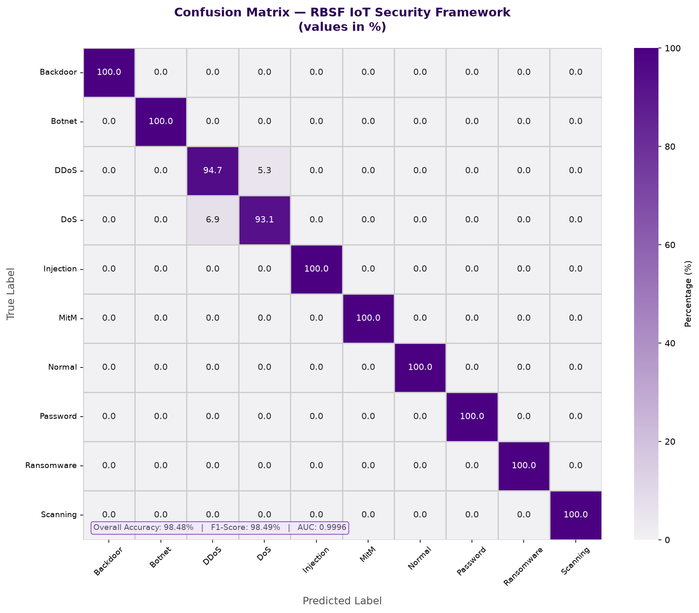
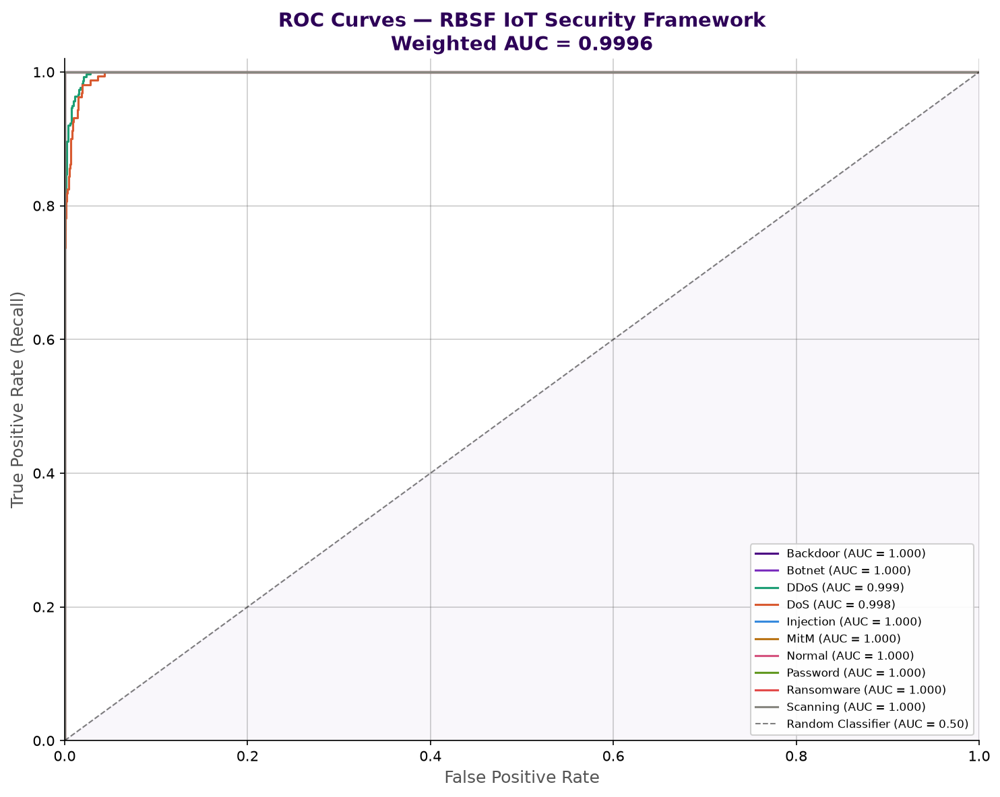
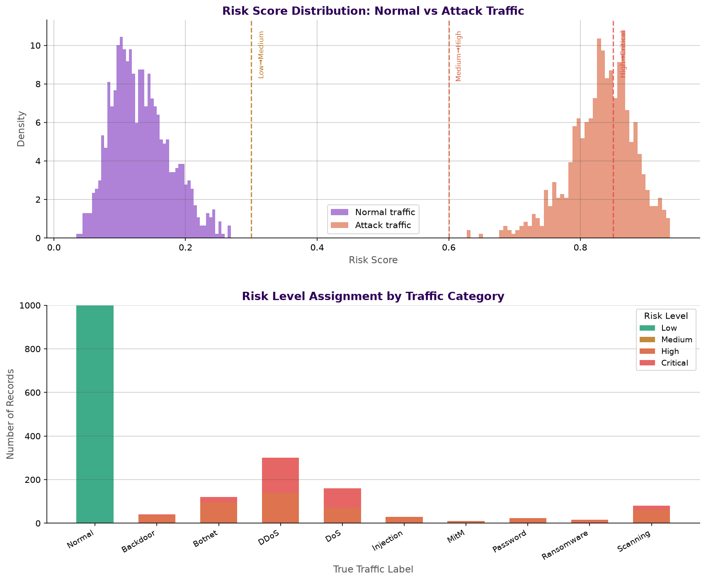

# RBSF — Risk-Based Security Framework for IoT Devices

A machine-learning-driven framework that scores IoT network traffic by **risk level** rather than just classifying it as "attack" or "normal." Combines supervised classification, unsupervised anomaly detection, and a weighted risk-fusion formula to produce a continuous 0–1 risk score and a Low/Medium/High/Critical label for every record — closer to how a real SOC analyst triages alerts than a binary detector.

Master's thesis project, MTUCI (Moscow Technical University of Communications and Informatics), Information Security profile (КИиБ — Интеллектуальные технологии безопасности компьютерных систем).

**Author:** Happi Ondobo Steve

---

## Project status

This is a **two-phase project**. Phase 1 is complete; Phase 2 is in progress.

| Phase | Description | Status |
|---|---|---|
| **Phase 1** | Full pipeline built and validated on a controlled synthetic dataset (statistically modeled IoT/network traffic across 10 classes) | ✅ Complete |
| **Phase 2** | Re-validation of the same pipeline against the **TON_IoT** public dataset (real IoT telemetry + network attack traffic) | 🔄 In progress |

Building and debugging the full pipeline on synthetic data first — where ground truth and class balance are fully controlled — made it possible to validate the architecture, the risk-fusion logic, and the evaluation process before testing against noisier real-world data. The results below are Phase 1 results. **They demonstrate that the framework works end-to-end; they are not yet a claim about real-world detection performance**, which is what Phase 2 will establish.

---

## Why a "risk score" instead of just a classifier

Most IoT intrusion detection projects stop at classification: is this traffic an attack, yes or no, and which type. That's useful, but it's not what a risk-based security framework, or a real security team, actually needs. A classifier gives you a label per packet; an analyst needs a way to **prioritize what to look at first**.

RBSF instead computes, for every record:

```
R = α·C + β·A + γ·H
```

- **C — Classification score**: probability the record is an attack, from a supervised Random Forest classifier (`P(attack) = 1 − P(Normal)`)
- **A — Anomaly score**: how statistically unusual the record is, from an Isolation Forest trained only on normal traffic — this is what lets the framework flag attack *patterns it has never seen labeled before*
- **H — History score**: rolling average of recent risk scores, a simplified stand-in for per-device behavioral history in a real deployment
- **α, β, γ**: weights (0.55 / 0.30 / 0.15) reflecting how much each signal should count toward the final score

The result is mapped to four bands — **Low (0–0.30) / Medium (0.31–0.60) / High (0.61–0.85) / Critical (0.86–1.00)** — so the output is directly actionable rather than a probability number that needs further interpretation.

Combining a supervised model with an unsupervised one is also a deliberate choice: the Random Forest is strong on attack types it was trained on, but blind to novel ones; the Isolation Forest, trained only on what "normal" looks like, can flag traffic that doesn't fit any known pattern, supervised or not. The risk formula lets both signals contribute rather than picking one model and losing the other's coverage.

---

## Pipeline

```
1_preprocess.py    →  generate dataset, clean, encode, scale, select top-30 features (mutual information), train/test split
2_train_models.py  →  SMOTE class balancing → Random Forest (5-fold CV) + Isolation Forest (trained on normal-only traffic)
3_evaluate.py       →  test-set metrics, confusion matrix, ROC curves, feature importance
4_risk_scorer.py    →  fuse C / A / H into final risk score + risk level, per-record dashboard summary
```

Each script reads the previous script's output from `rbsf_output/` and writes its own results there, so the pipeline runs as four sequential steps.

### Dataset (Phase 1)

10 traffic classes modeled after common IoT/network attack categories, generated with class-specific statistical distributions (packet rates, byte ratios, connection error rates, protocol distributions, etc.) chosen to reflect realistic differences between attack types — e.g. DDoS traffic is modeled as high packet volume / very short duration, scanning as many short connections across many destination ports, brute-force password attacks as repeated failed logins with low byte volume.

| Class | Records | Description |
|---|---|---|
| Normal | 5,000 | Baseline traffic |
| DDoS | 1,500 | Distributed denial of service |
| DoS | 800 | Denial of service |
| Botnet | 600 | C2 beaconing pattern |
| Scanning | 400 | Port/host scanning |
| Backdoor | 200 | Persistent unauthorized access |
| Injection | 150 | Injection-style attack traffic |
| Password | 120 | Brute-force login attempts |
| Ransomware | 80 | Large read + encrypted upload pattern |
| MitM | 50 | Man-in-the-middle |

21 base features (traffic volume, timing, connection-state, and simulated device telemetry such as CPU/memory usage) are one-hot encoded and reduced to the top 30 by mutual information score before training.

### Dataset (Phase 2 — planned)

[**TON_IoT**](https://research.unsw.edu.au/projects/toniot-datasets) — a public dataset of real IoT/IIoT telemetry and network traffic with labeled attacks, developed by UNSW Canberra Cyber. Re-running the same pipeline against TON_IoT (with appropriate feature-mapping, since the schemas differ) is the next milestone — see [Roadmap](#roadmap).

---

## Results (Phase 1, synthetic data)
## Results (Phase 1, synthetic data)

| Metric | Score |
|---|---|
| Accuracy | 98.48% |
| F1-score (weighted) | 98.49% |
| AUC-ROC (weighted) | 0.9996 |
| Matthews correlation coefficient | 0.9763 |
| False Positive Rate | 0.17% |
| False Negative Rate | 1.22% |

Per-class F1 ranges from 91.7% (DoS) to a clean 100% on most other classes, with Random Forest's confusion almost entirely between DoS and DDoS — the two classes with the most overlapping traffic-volume profiles by construction.

**Why these numbers are this high — and why that's expected, not a red flag:** each class in the synthetic dataset was generated from its own fixed statistical distribution (e.g. DDoS = high packet volume + short duration, Scanning = many short connections across many ports). A classifier trained on this data is, in effect, learning to reverse-engineer those generation rules — a much easier task than separating real, noisy network traffic where attack and normal behavior overlap far more. **These results validate that the pipeline and risk-fusion logic work correctly end-to-end; they are not a claim about real-world detection accuracy.** That claim can only be made after Phase 2 (TON_IoT validation) — expect meaningfully lower, more realistic numbers there, and that will be the result worth trusting.

The Isolation Forest shows a clear separation between normal and attack traffic (mean anomaly score 0.23 vs 0.70, a 3.0× gap), confirming the anomaly-detection signal is contributing real information to the fused risk score rather than just noise.





> Run `3_evaluate.py` to regenerate `rbsf_output/metrics_report.txt` and update this table with your actual numbers before publishing.


---

## Setup & usage

```bash
git clone https://github.com/<your-username>/rbsf-iot-risk-framework.git
cd rbsf-iot-risk-framework
pip install -r requirements.txt

cd src
python 1_preprocess.py
python 2_train_models.py
python 3_evaluate.py
python 4_risk_scorer.py
```

All intermediate files, trained models, and charts are written to `src/rbsf_output/` (not committed to the repo — see `.gitignore`).

---

## Roadmap

- [ ] **Phase 2:** Validate the pipeline against the real TON_IoT dataset; map TON_IoT's feature schema onto the framework's feature set
- [ ] Compare Phase 1 (synthetic) vs Phase 2 (TON_IoT) results directly — does the risk-fusion approach hold up on real traffic?
- [ ] Per-device history tracking (the `H` term is currently a simplified rolling average; a real deployment would track this per device/IP over time)
- [ ] Lightweight Flask dashboard for live risk-score visualization
- [ ] Threshold tuning / cost-sensitive evaluation (false negatives on Critical-risk traffic are more costly than false positives — current thresholds are not yet optimized for this asymmetry)

---

## Tech stack

Python · scikit-learn · imbalanced-learn (SMOTE) · pandas / numpy · matplotlib / seaborn

---

## Author

**Happi Ondobo Steve**
MTUCI — Master's in Information Security (Intelligent Security Technologies for Computer Systems)

[@HappiOndobo](#) · [@HappiOndobo](#)
